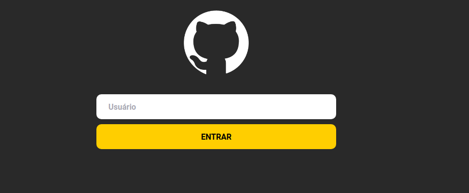
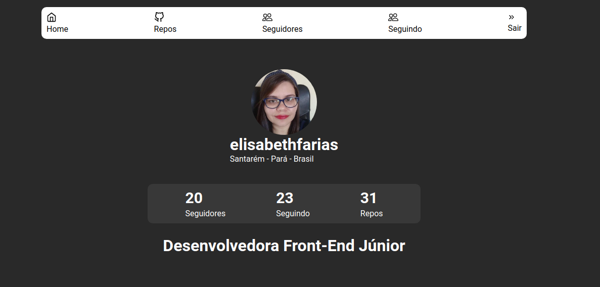

# 📝 GitHub Explorer:

"A aplicação é um PWA que funcionará em cima da API do GitHub. Possui tela de login onde o usuário digitará o username do github. Ao buscar esse usuário, ele será redirecionado para uma tela interna onde estará disponível informações gerais do usuário. Além disso, possui outras telas como: Home, Repositórios, Seguidores, Seguindo".




📁  Como baixar o projeto

```
# Clonar o repositório
$ git clone

# Entrar no diretório
$ cd labluby_challenge

# Iniciando o projeto
$ yarn start
```


⚙️ Construído com:
- HTML
- CSS
- React
- TypeScript
- React-router-dom
- Styled-components
- React-icons
